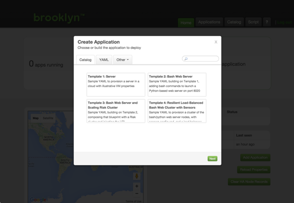

This guide will walk you through connecting to the Brooklyn Server Graphical User Interface and performing various tasks.

For an explanation of common Brooklyn Concepts see the [Brooklyn Concepts Quickstart](../../start/concept-quickstart.html) or see the  full guide in the [Brooklyn Concepts](../../concepts) chapter of the [User Guide](../../).

This guide assumes that you are using Linux or Mac OS X and that Brooklyn Server will be running on your local system.

## Launch Apache Brooklyn

If you haven't already done so, you will need to start Brooklyn Server using the commands shown below.  
It is not necessary at this time, but depending on what you are going to do, 
you may wish to set up some other configuration options first,
 
* [Security](../brooklyn_properties.html)
* [Persistence](../persistence/)

Now start Brooklyn with the following command:


$ cd apache-brooklyn-{{ site.brooklyn.version }}
$ bin/brooklyn launch


Please refer to the [Server CLI Reference](../server-cli-reference.html) for details of other possible command line options.

Brooklyn will output the address of the management interface:

<pre>
INFO  No security provider options specified. ...
INFO  Starting Brooklyn web-console with passwordless access on localhost ...
INFO  Starting brooklyn web-console on loopback interface because no security config is set
INFO  Started Brooklyn console at http://127.0.0.1:8081/, running classpath://brooklyn.war
</pre>

## Connect with Browser

Next, open the web console on [http://127.0.0.1:8081](http://127.0.0.1:8081). 
No applications have been deployed yet, so the "Create Application" dialog opens automatically.

## Next
The next section will show how to **[deploy a blueprint](blueprints.html)**.