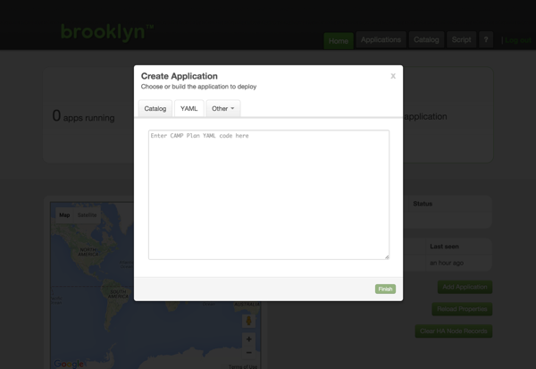



## Launching from a Blueprint

We'll start by deploying an application via YAML blueprint consisting of the following layers.

- Nginx load balancer
- Tomcat app server cluster
- MySQL DB

When you first access the web console on [127.0.0.1:8081](http://127.0.0.1:8081) you will be requested to create your first application.

Switch to the YAML tab and copy the blueprint below into the large text box. 

But *before* you submit it, modify the YAML to specify the location where the application will be deployed.





Replace the `location:` element with values for your chosen target environment, for example to use SoftLayer rather than AWS (updating with your own credentials): 


location:
  jclouds:softlayer:
    identity: ABCDEFGHIJKLMNOPQRST
    credential: s3cr3tsq1rr3ls3cr3tsq1rr3ls3cr3tsq1rr3l


**Note**: See __[Locations](../ops/locations)__ in the Operations section of the User Guide for instructions on setting up alternate cloud providers, bring-your-own-nodes, or localhost targets, and storing credentials/locations in a file on disk rather than in the blueprint.

With the modified YAML in the dialog, click "Finish". The dialog will close and Brooklyn will begin deploying your
application. Your application will be shown as "Starting" on the web console's front page.

Depending on your choice of location it may take some time for the application nodes to start, the next page describes how you can monitor the progress of the application deployment and verify its successful deployment.

### Launching from the Catalog

Instead of pasting the YAML blueprint each time, it can be added to Brooklyns Catalog where it will be accessible from the Catalog tab of the Create Application dialog.

<!-- TODO: more detail for adding to catalog? but wait for persistence to be the default, 
     rather than extensively document default.catalog.bom.
     also need to include instructions on stopping (currently in help, including stopping apps) -->

See __[Catalog](../ops/catalog/)__ in the Operations section of the User Guide for instructions on creating a new Catalog entry from your Blueprint YAML.

## Next 

So far we have touched on Brooklyn's ability to *deploy* an application blueprint to a cloud provider, but this just the beginning, proceed to  **[Monitoring and Managing Applications](managing.html)**.
