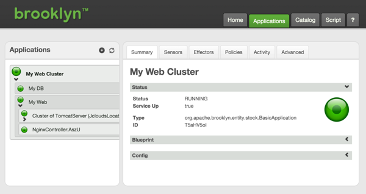
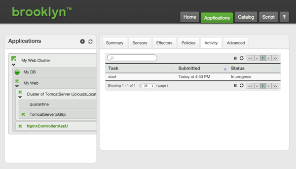
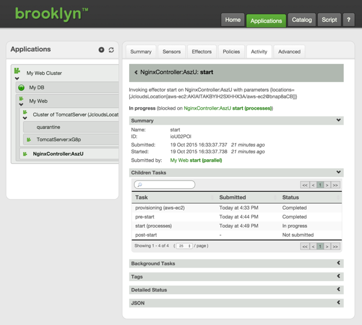
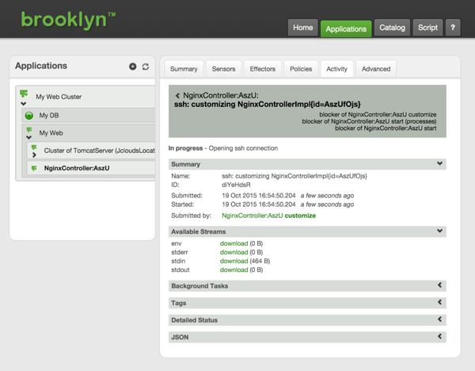
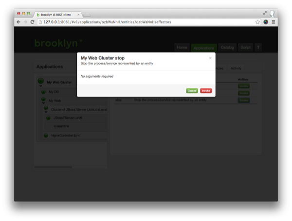

Click on the application name, or open the Applications tab.

We can explore the management hierarchy of the application, which will show us the entities it is composed of.

 * My Web Cluster (A `BasicApplication`)
     * My DB (A `MySqlNode`)
     * My Web (A `ControlledDynamicWebAppCluster`)
        * Cluster of TomcatServer (A `DynamicWebAppCluster`)
        * NginxController (An `NginxController`)

Clicking on the "My Web Cluster" entity will show the "Summary" tab,
giving a very high level of what that component is doing. 
Click on each of the child components in turn for more detail on that component. 
Note that the cluster of web servers includes a "quarantine group", to which members of the 
cluster that fail will be added. These are excluded from the load-balancer's targets.

## Activities

The Activity tab allows us to drill down into the tasks each entity is currently executing or has recently completed. It is possible to drill down through all child tasks, and view the commands issued, along with any errors or warnings that occurred.

For example clicking on the NginxController in the left hand tree and opening its Activity tab you can observe the 'start' task is 'In progress'.

**Note**: You may observe different tasks depending on how far your deployment has progressed).

Clicking on the 'start' task you can discover more details on the actions being carried out by that task (a task may consist of additional subtasks).

Continuing to drill down into the 'In progress' tasks you will eventually reach the currently active task where you can investigate the ssh command executed on the target node including the current stdin, stdout and stderr output.

## Sensors

Now click on the "Sensors" tab:
these data feeds drive the real-time picture of the application.
As you navigate in the tree at the left, you can see more targeted statistics coming in in real-time.

Explore the sensors and the tree to find the URL where the _NginxController_ for the webapp we just deployed is running. This can be found in '**My Web Cluster** -> **My Web** -> **NginxController** -> **_main.uri_**'.

Quickly return to the **‘Brooklyn JS REST client’** web browser
tab showing the "Sensors" and observe the '**My Web Cluster** -> **My Web** -> **Cluster of TomcatServer** -> **_webapp.reqs.perSec.last_**' sensor value increase.  

## Stopping the Application

To stop an application, select the application in the tree view (the top/root entity), click on the Effectors tab, and invoke the "Stop" effector. This will cleanly shutdown all components in the application and return any cloud machines that were being used.

### Next

Brooklyn's real power is in using **[Policies](policies.html)**  to automatically *manage* applications. 
