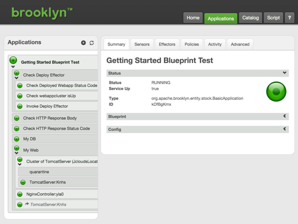



## Introduction
This section describes some simple tests based on the [Getting Started](../../start/blueprints.html#launching-from-a-blueprint) example blueprint:





The following sections contain yaml snippets that be appended to the list of services in the blueprint above, a complete blueprint is also provided [below](#full-example).

Note that unless otherwise specified the following tests are executed in parallel with the deployment of the application services, all `timeout` values are set accordingly.

### Sensor Test

Demonstrates the following sensor assertion:

- asserts that the `webappcluster` entity `service.isUp` sensor is `true` within 10 minutes of blueprint being deployed.





### HTTP Call Tests
Demonstrates the following HTTP Call assertions against the specified `url`, which in these examples are being built from the `webappcluster` entities `host.address` and `proxy.http.port` sensors (the tester having flexibility in how the test URL is to be constructed):

- asserts the response status code is 200 within 10 minutes of the blueprint being deployed.
- asserts the response body matches the regex `(?s).*Br[o]{2}klyn Deployed.*` within 10 minutes of the blueprint being deployed. Note the presence of the `(?s)` dotall flag to test a multiline response.





### Effector Test (via TestCase entity)

This `TestEffector` example demonstrates the use of the `TestCase` and `TestSensor` entities to ensure the service has started before invoking an effector using the `TestEffector` entity.

- `TestCase` entity starts its children sequentially
  - asserts that the `webappcluster` entity `service.isUp` sensor is `true` within 10 minutes of the parent `TestCase` entity starting. Blocks start of the next child until it obtains a result (or times out).
  - `deploy` effector invoked to deploy war to a `newcontext` with a 5 minute timeout to allow completion of the deploy task.
  - asserts `/newcontext` url returns a HTTP status code 200 within 5 minutes of the effector being invoked (Note that this timeout is relative to the preceding test entity as they are being sequentially run as children of a `TestCase` entity).





### Full Example
A sample blueprint containing all the tests described above is available [here](./example_yaml/testcases/getting-started-test-example.yaml).

This blueprint will deploy the [Getting Started](../../start/blueprints.html#launching-from-a-blueprint) application and run all of the test entities, which if successful should appear in the web console as follows.

