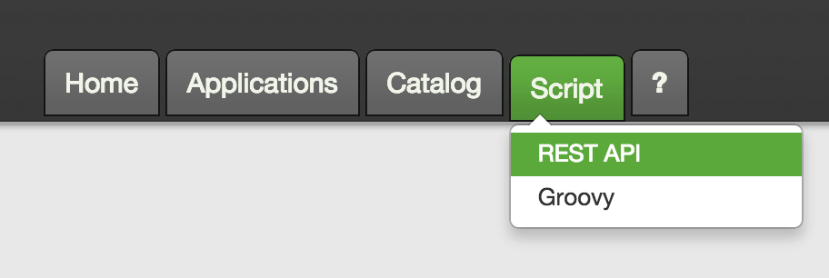

## API Overview

Brooklyn has a comprehensive REST API which can be used to perform all of the actions that 
are possible through the web console, as well as additional functionality exclusive to the API.

Brooklyn uses [Swagger](http://swagger.io/) to generate its REST API and documentation.

## Accessing the API Documentation

The complete REST API can be found in the web console (link pictured below) of your running 
Brooklyn instance.
Here you can view, as well as execute, every API call that Brooklyn has to offer.

 