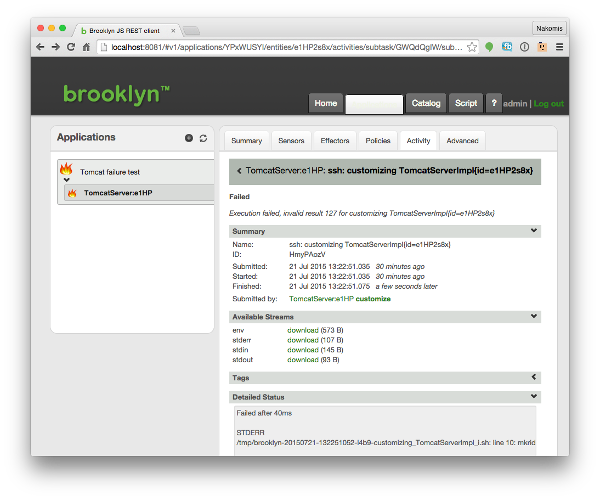

This guide describes sources of information for understanding when things go wrong.

Whether you're customizing out-of-the-box blueprints, or developing your own custom blueprints, you will
inevitably have to deal with entity failure. Thankfully Brooklyn provides plenty of information to help 
you locate and resolve any issues you may encounter.

## Web-console Runtime Error Information
 
### Entity Hierarchy

The Brooklyn web-console includes a tree view of the entities within an application. Errors within the
application are represented visually, showing a "fire" image on the entity.

When an error causes an entire application to be unexpectedly down, the error is generally propagated to the
top-level entity - i.e. marking it as "on fire". To find the underlying error, one should expand the entity
hierarchy tree to find the specific entities that have actually failed.

### Entity's Error Status

Many entities have some common sensors (i.e. attributes) that give details of the error status:

* `service.isUp` (often referred to as "service up") is a boolean, saying whether the service is up. For many 
  software processes, this is inferred from whether the "service.notUp.indicators" is empty. It is also
  possible for some entities to set this attribute directly.
* `service.notUp.indicators` is a map of errors. This often gives much more information than the single 
  `service.isUp` attribute. For example, there may be many health-check indicators for a component: 
  is the root URL reachable, it the management api reporting healthy, is the process running, etc.
* `service.problems` is a map of namespaced indicators of problems with a service.
* `service.state` is the actual state of the service - e.g. CREATED, STARTING, RUNNING, STOPPING, STOPPED, 
  DESTROYED and ON_FIRE.
* `service.state.expected` indicates the state the service is expected to be in (and when it transitioned to that).
  For example, is the service expected to be starting, running, stopping, etc.

These sensor values are shown in the "sensors" tab - see below.

### Sensors View

The "Sensors" tab in the Brooklyn web-console shows the attribute values of a particular entity.
This gives lots of runtime information, including about the health of the entity - the 
set of attributes will vary between different entity types.

Note that null (or not set) sensors are hidden by default. You can click on the `Show/hide empty records` 
icon (highlighted in yellow above) to see these sensors as well.

The sensors view is also tabulated. You can configure the numbers of sensors shown per page 
(at the bottom). There is also a search bar (at the top) to filter the sensors shown.

### Activity View

The activity view shows the tasks executed by a given entity. The top-level tasks are the effectors
(i.e. operations) invoked on that entity. This view allows one to drill into the task, to 
see details of errors.

Select the entity, and then click on the `Activities` tab.

In the table showing the tasks, each row is a link - clicking on the row will drill into the details of that task, 
including sub-tasks:

For ssh tasks, this allows one to drill down to see the env, stdin, stdout and stderr. That is, you can see the
commands executed (stdin) and environment variables (env), and the output from executing that (stdout and stderr). 

For tasks that did not fail, one can still drill into the tasks to see what was done.

It's always worth looking at the Detailed Status section as sometimes that will give you the information you need.
For example, it can show the exception stack trace in the thread that was executing the task that failed.

## Log Files

Brooklyn's logging is configurable, for the files created, the logging levels, etc. 
See [Logging docs](../logging.html).

With out-of-the-box logging, `brooklyn.info.log` and `brooklyn.debug.log` files are created. These are by default 
rolling log files: when the log reaches a given size, it is compressed and a new log file is started.
Therefore check the timestamps of the log files to ensure you are looking in the correct file for the 
time of your error.

With out-of-the-box logging, info, warnings and errors are written to the `brooklyn.info.log` file. This gives
a summary of the important actions and errors. However, it does not contain full stacktraces for errors.

To find the exception, we'll need to look in Brooklyn's debug log file. By default, the debug log file
is named `brooklyn.debug.log`. You can use your favourite tools for viewing large text files. 

One possible tool is `less`, e.g. `less brooklyn.debug.log`. We can quickly find the last exception 
by navigating to the end of the log file (using `Shift-G`), then performing a reverse-lookup by typing `?Exception` 
and pressing `Enter`. Sometimes an error results in multiple exceptions being logged (e.g. first for the
entity, then for the cluster, then for the app). If you know the text of the error message (e.g. copy-pasted
from the Activities view of the web-console) then one can search explicitly for that text.

The `grep` command is also extremely helpful. Useful things to grep for include:

* The entity id (see the "summary" tab of the entity in the web-console for the id).
* The entity type name (if there are only a small number of entities of that type). 
* The VM IP address.
* A particular error message (e.g. copy-pasted from the Activities view of the web-console).
* The word WARN etc, such as `grep -E "WARN|ERROR" brooklyn.info.log`.

Grep'ing for particular log messages is also useful. Some examples are shown below:

* INFO: "Started application", "Stopping application" and "Stopped application"
* INFO: "Creating VM "
* DEBUG: "Finished VM "
