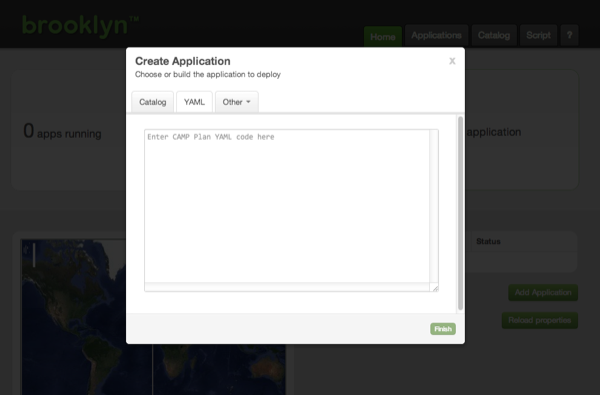



## Launching from a Blueprint

We'll start by deploying an application from a YAML blueprint.

Copy the blueprint below into the large text box on the YAML tab. 
But *before* you submit it, we need to make a modification.





Find the line near the top of the blueprint that starts `location:`. 
Change this to have the right values for your preferred target; for example: 


location:
  jclouds:aws-ec2:
    identity: ABCDEFGHIJKLMNOPQRST
    credential: s3cr3tsq1rr3ls3cr3tsq1rr3ls3cr3tsq1rr3l


Alternatively, if you have `ssh localhost` [configured](../ops/locations/#localhost) you can leave it as is.
See __[Locations](../ops/locations)__ in the Operations section of the User Guide for detail on setting up
cloud providers, including putting credentials in a file on disk rather than in the blueprint.

With the modified YAML in the dialog, click "Finish". The dialog will close and Brooklyn will begin deploying your
application. Your application will be shown as "Starting" on the web console's front page.

### Launching from the Catalog

Instead of pasting the YAML blueprint each time,
this blueprint can be [added to the catalog](../ops/catalog/).
With this YAML blueprint added, including the location, the Add Application dialog will offer 
the "Demo Web Cluster with DB" as a template.

<!-- TODO: more detail for adding to catalog? but wait for persistence to be the default, 
     rather than extensively document default.catalog.bom.
     also need to include instructions on stopping (currently in help, including stopping apps) -->

## Next 

So far we have touched on Brooklyn's ability to *deploy* an application blueprint to a cloud provider, 
but this just the beginning.  **[Start managing this application.](managing.html)**
