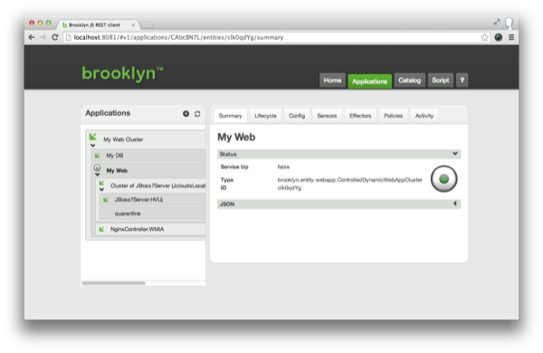

Click on the application name, or open the Applications tab.

We can explore the management hierarchy of the application, which will show us the entities it is composed of.

 * My Web Cluster (A `BasicApplication`)
     * My DB (A `MySqlNode`)
     * My Web (A `ControlledDynamicWebAppCluster`)
        * Cluster of JBoss7 Servers (A `DynamicWebAppCluster`)
        * NginxController (An `NginxController`)

Clicking on the "My Web" entity will show the "Summary" tab,
giving a very high level of what that component is doing. 

## Sensors

Now click on the "Sensors" tab:
these data feeds drive the real-time picture of the application.
As you navigate in the tree at the left, you can see more targeted statistics coming in in real-time.

Explore the sensors and the tree to find a URL where the webapp we just deployed is running
and open that in a new tab. Quickly return to the "Sensors" tab and observe the requests-per-second sensor increase.  

## Activities

The Activity tab allows us to drill down into the activities each entity is currently doing or has recently done. 
It is possible to drill down to all child tasks, and view the commands issued, and any errors or warnings that occured.

Drill into the "My DB" start operation. 
Working down through  "Start (processes)", then "launch", we can discover the ssh command used including the stdin, stdout and stderr.

## Stopping the Application

To stop an application, select the application in the tree view (the top/root entity), click on the Effectors tab, and invoke the "Stop" effector. This will cleanly shutdown all components in the application and return any cloud machines that were being used.

### Next

Brooklyn's real power is in using **[Policies](policies.html)**  to automatically *manage* applications. 
