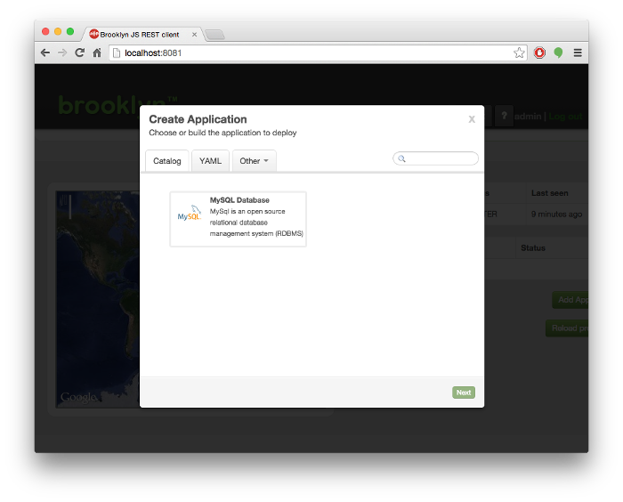

In addition to deploying [YAML blueprints](creating-yaml.html) directly through the web console, it is possible
to add YAML blueprints to the catalog via Brooklyn's REST API.

The catalog is a collection of versioned blueprints, which can be deployed directly or referenced 
by other blueprints.  Blueprints in the catalog can be deployed via the Brooklyn REST API, or from 
the web-console's 'Catalog' section of the 'Create Application' dialog box.

All YAML blueprints added to the catalog must also contain a `brooklyn.catalog` section. 

For a blueprint to be accessible via the 'Create Application' dialog, it must be an Application 
(i.e. the entity at the root of the blueprint must implement `brooklyn.entity.Application`).
If just deploying via the REST API, then this is not necessary.

<!--
TODO: Add section that explains how to add plain entities to the catalog and use them either from the App Wizard,
(and entity UI) or embed the catalog id + version in another YAML
-->

Let's take the following YAML as a starting point.


location: localhost

name: MySQL Database
services:
- type: brooklyn.entity.database.mysql.MySqlNode
  brooklyn.config:
    datastore.creation.script.url: classpath://visitors-creation-script.sql


We will convert it for adding to the catalog, such that it will usable through the 
'Create Application' dialog.

The steps are therefore:

* Add a brooklyn.catalog section to give metadata about the version etc. This is also used 
  when displaying the blueprint in the 'Add Application' dialog.
* Remove the explicit location (as the user will typically select the location in the GUI).
* Add a root element that extends `brooklyn.entity.Application`. As we don't require any
  custom application-specific logic, we can use the `brooklyn.entity.basic.BasicApplication` 
  class. We can then add our MySqlNode as a child of the BasicApplication. 
  (When deploying via YAML at the REST API, this is not necessary as Brooklyn will do this 
  automatically).


brooklyn.catalog:
  id: MySQL
  version: 1.0
  iconUrl: classpath://mysql.png
  description: MySql is an open source relational database management system (RDBMS)

name: MySQL Database
services:
- type: brooklyn.entity.basic.BasicApplication
  brooklyn.children:
  - type: brooklyn.entity.database.mysql.MySqlNode
    brooklyn.config:
      datastore.creation.script.url: classpath://visitors-creation-script.sql


<!--
TODO: Add documentation to explain that the brooklyn.catalog section can contain a libraries array, each item pointing to 
an OSGi bundle where the code for the blueprint is hosted. Every type from the blueprint will be searched for in the 
libraries first and then on the standard Brooklyn classpath.*
-->

To explain the `brooklyn.catalog` section:

- The `id: MySQL` section specifies a unique ID used by Brooklyn to identify the catalog item. This ID is also passed to 
`UsageManager.UsageListener.onApplicationEvent` for metering purposes.
- The `version: 1.0` section provides a unique version for the *blueprint*. NOTE: This is *not* the version of the software
being installed (in this case MySQL).
- The `iconUrl: classpath://...` is an optional, but recommended, section that allows you to provide a graphic to be 
displayed in the 'Add Application' dialog alongside the blueprint name. These image files should be placed in the 
`conf` folder to make them available at runtime.
- The `description: ...` section allows you to give a free-format description of the blueprint, which is displayed in the 
'Add Application' dialog.

To add the blueprint to the catalog, post the YAML file to Brooklyn's REST API by using the `curl` command as
follows (substituting your own usename:password, URL and file path):


curl -u admin:password http://127.0.0.1:8081/v1/catalog --data-binary @/path/to/mysql-catalog.yaml


This will add the blueprint to the catalog as shown here:
 

If you attempt to run the curl command a second time, you will receive an error stating `Updating existing catalog entries is forbidden`.
To update the blueprint, you will need to change the version number in your yaml file before running the curl command 
again. This will create a second blueprint. You can then delete the old version via the REST API, using its ID and version
as follows:


curl -u admin:password -X DELETE http://127.0.0.1:8081/v1/catalog/entities/MySQL/1.0


**Note** Catalog items should not be deleted if there are running apps which were created using the same item. During
rebinding the catalog item is used to reconstruct the entity.

<!--
TODO: Add documentation about adding policies to the catalog, and explaining how to add items to 
the UI using the plus icon on the catalog tab*

TODO: describe entity addition (this just covers app addition)

TODO: describe how to use the web-console GUI
-->
