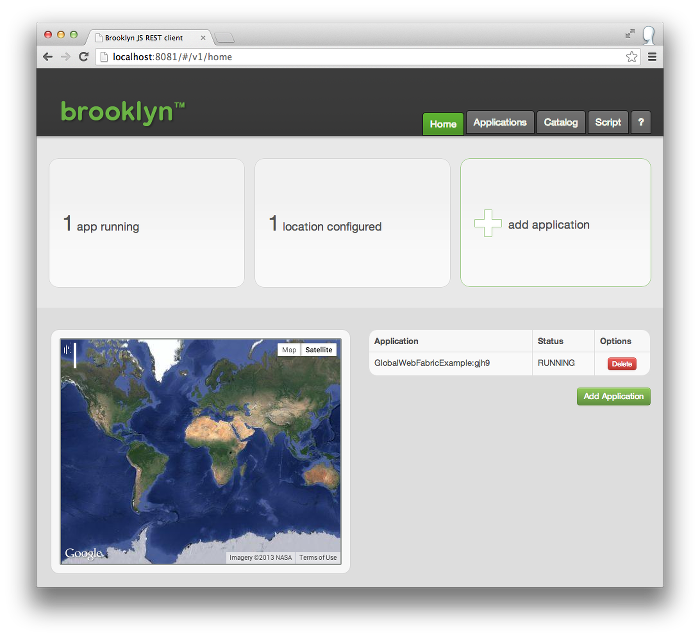
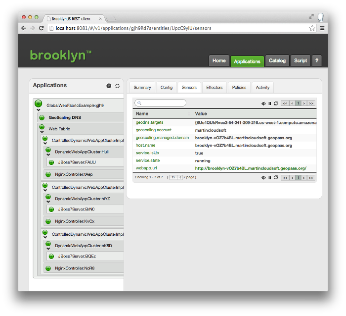
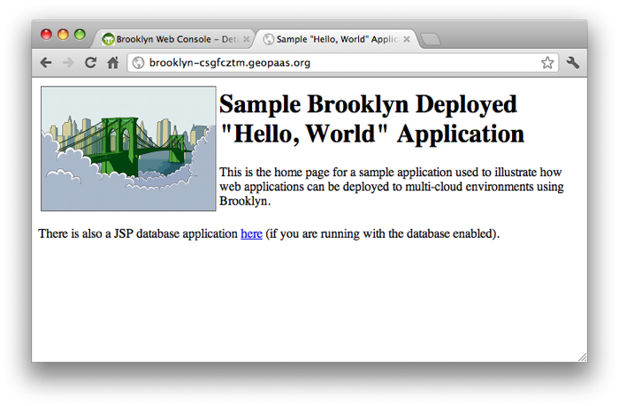

This example shows how to build a multi-site web application *fabric*
with DNS configured on the front-end to combine the sites,
routing users to the location closest to them.

It can combine with the [Simple Web Cluster](../webcluster) example
or the [Portable Cloud Foundry](https://github.com/cloudsoft/brooklyn-cloudfoundry) example,
but does not assume knowledge of either of these.



Now, go to this particular example's directory:


% cd global-web-fabric


The CLI needs to know where to find your compiled examples. You can set this up by exporting
the ``BROOKLYN_CLASSPATH`` environment variable in the following way:


% export BROOKLYN_CLASSPATH=$(pwd)/target/classes


The project ``global-web-fabric`` contains the code used
in this example under ``src/main/java``.

### Setting Up Geographic DNS

This example uses [geoscaling.com](http://www.geoscaling.com) to provide **free** geographic-dependent DNS services.
This will forward a domain name of your choice to various IPs depending on a script,
e.g. computing the nearest IP based on latitude and longitude of the requester and the targets.
Brooklyn will automatically generate and update this script, but you do need to 
create and configure a Geoscaling account:

 1. Create the free account [here](https://www.geoscaling.com/dns2/?module=register).
 1. Click the link in the email you receive.
 1. Enter the domain name you wish to use into geoscaling (see below).

The simplest domain name to choose is something unique under `geopaas.org`, e.g. `yourname.geopaas.org`,
which we have already configured for Geoscaling to manage.
If you are using your own domain name, 
set its nameservers as advised by geoscaling (e.g. `ns{1,2,3,4}.geoscaling.com`).

Next we need to supply this information to Brooklyn at runtime.
The simplest way is to create or add the following fields to `~/.brooklyn/brooklyn.properties`:


brooklyn.geoscaling.username=yourname
brooklyn.geoscaling.password=s3cr3t
brooklyn.geoscaling.primaryDomain=yourname.geopaas.org


Replace the values of these fields as appropriate, of course!
You can, if you prefer, supply (or override) these values in your Brooklyn application.

### Setting Up the Locations Database

In order to generate the "closest-IP" script,
Brooklyn needs a way to find out the latitude and longitude of the
servers you are using.
The simplest way to do this is do download the free GeoCityLite binary flatfile 
from [MaxMind](http://dev.maxmind.com/geoip/geoip2/geolite2/#Downloads),
unpack it, and copy it to `~/.brooklyn/GeoLite2-City.mmdb`.

This will be picked up automatically if it is installed.
You can instead specify to use an online lookup service, such as 
[utrace.de](http://www.utrace.de) by specifying
`-Dbrooklyn.location.geo.HostGeoLookup=brooklyn.location.geo.UtraceHostGeoLookup`;
but note this has a cap of 100 per day.

This information is also used to display locations on the map
in the Brooklyn dashboard.
Note however that these free services are not 100% accurate;
they are handy for dev/test but in a production system
you may wish to specify the geographical information manually in your application,
or purchase a commercial locations-database subscription.

## The Code

Now let's start writing our application.
The heavy lifting will be done by off-the-shelf Brooklyn classes:

 * `DynamicFabric` will create the entity specified by `factory` in each location it is given
 * `GeoscalingDnsService` monitors children of a specified entity (the `DynamicFabric`) 
   and adds them as DNS targets for the region they are in  

First, however, let's create the Java class -- call it `GlobalWebFabricExample`.
This will extend the Brooklyn `AbstractApplication`:


package brooklyn.demo;

import static com.google.common.base.Preconditions.checkNotNull;
import brooklyn.entity.basic.AbstractApplication;

public class GlobalWebFabricExample extends AbstractApplication {
    @Override
    public void init() {
         // TODO create our app!
    }
}


### The Fabric

The `DynamicFabric` by default has no knowledge of what it will build,
other than the `factory` it is given to create an entity in each region.
We'll use the class `ElasticJavaWebAppService.Factory` which creates
an elastic Java Web App service,
such as the `ControlledDynamicWebAppCluster` used in the
[Simple Web Cluster](../webcluster) example, if deploying to VMs,
or perhaps a `CloudFoundryJavaWebAppCluster` if deploying to a Cloud Foundry location
(see [brooklyn-cloudfoundry repo](https://github.com/cloudsoft/brooklyn-cloudfoundry)).


        DynamicFabric webFabric = addChild(EntitySpec.create(DynamicFabric.class)
                .displayName("Web Fabric")
                .configure(DynamicFabric.FACTORY, new ElasticJavaWebAppService.Factory())
                .configure(ElasticJavaWebAppService.ROOT_WAR, WAR_PATH));


Here we have specified the WAR to use with `configure(ElasticJavaWebAppService.ROOT_WAR, WAR_PATH)`.
The war configuration used in the previous example is only available on web-aware entities;
configuration specified with a ConfigKey can be done on any entity,
and is inherited at runtime, so this provides a useful way to specify the WAR to use
even though the web-aware entities are only constructed at runtime.

### Stitching the Fabric together with DNS

To stitch these together seamlessly, another entity will run a policy
which collects the public-facing IP address of each cluster created by the fabric,
as it comes online, by watching for `SERVICE_UP` sensors.
First, however, let's make sure any load-balancer proxies (e.g. nginx) in these clusters
are listening on port 80:


        DynamicFabric webFabric = addChild(EntitySpec.create(DynamicFabric.class)
                .displayName("Web Fabric")
                .configure(DynamicFabric.FACTORY, new ElasticJavaWebAppService.Factory())
                .configure(ElasticJavaWebAppService.ROOT_WAR, WAR_PATH)
                .configure(AbstractController.PROXY_HTTP_PORT, PortRanges.fromInteger(80)));


Let's now define the Geoscaling entity which does the stitching.
We need to supply the username, password, and primaryDomainName for Geoscaling;
we'll take this from the `brooklyn.properties` file mentioned above.
We'll also specify a `smartSubdomainName`, to use Geoscaling's facility for
lightweight sub-domains to prevent DNS caching and multiple instances of our application
from confusing us -- e.g. `brooklyn-1234.yourname.geopaas.org`.


        StringConfigMap config = getManagementContext().getConfig();
        
        GeoscalingDnsService geoDns = addChild(EntitySpec.create(GeoscalingDnsService.class)
                .displayName("GeoScaling DNS")
                .configure("username", checkNotNull(config.getFirst("brooklyn.geoscaling.username"), "username"))
                .configure("password", checkNotNull(config.getFirst("brooklyn.geoscaling.password"), "password"))
                .configure("primaryDomainName", checkNotNull(config.getFirst("brooklyn.geoscaling.primaryDomain"), "primaryDomain")) 
                .configure("smartSubdomainName", "brooklyn"));


Lastly we need to tell this instance what entity it should monitor
for children to include as targets:


        geoDns.setTargetEntityProvider(webFabric);


### Cloud Foundry and other PaaS Targets

At this point our core application is ready, and can be deployed to AWS or another VM cloud.
This may take between 15 and 30 minutes to run,
mainly spent downloading software
(unless of course you specify a pre-configured `imageId` which contains the software).

A quicker alternative is to deploy to a Java Web App platform-as-a-service
such as Cloud Foundry.  A major advantage here is that they can provision very quickly,
in a matter of seconds.  Code for this can be found in the 
[brooklyn-cloudfoundry repo](https://github.com/cloudsoft/brooklyn-cloudfoundry), 
along with an example global-web-fabric app.

### Imports

Your imports should look as follows:


import static com.google.common.base.Preconditions.checkNotNull;

import org.slf4j.Logger;
import org.slf4j.LoggerFactory;

import brooklyn.config.StringConfigMap;
import brooklyn.entity.basic.AbstractApplication;
import brooklyn.entity.basic.Attributes;
import brooklyn.entity.dns.geoscaling.GeoscalingDnsService;
import brooklyn.entity.group.DynamicFabric;
import brooklyn.entity.proxy.AbstractController;
import brooklyn.entity.proxying.EntitySpec;
import brooklyn.entity.webapp.ElasticJavaWebAppService;
import brooklyn.location.basic.PortRanges;


### Use of main method (optional)

In this example, we will use the brooklyn CLI launcher. However, it is possible to write your own main method.

The following static constants are assumed (most of these as in the [Simple Web Cluster](../webcluster) example and others): 

 * `WAR_PATH`, pointing to the webapp to deploy (a default supplied as part of the Brooklyn examples is used here)
 * `DEFAULT_LOCATIONS`, containing a string spec of the locations to deploy to if none are supplied on the command-line;
   for this example `localhost` will frequently not work unless Geoscaling can see it 
   (i.e. it has a public IP and appropriate firewall settings)

The code (which can safely be omitted) is as follows:


import brooklyn.launcher.BrooklynLauncher;
import brooklyn.util.CommandLineUtil;

import com.google.common.base.Joiner;
import com.google.common.collect.ImmutableList;
import com.google.common.collect.Lists;

// class definition, and rest of class goes here...

    public static final Logger log = LoggerFactory.getLogger(GlobalWebFabricExample.class);
    
    // points to the webapp to deploy (a default supplied as part of the Brooklyn examples is used here)
    public static final String WAR_PATH = "classpath://hello-world-webapp.war";
    
    // locations to deploy to if none are supplied on the command-line; for this example `localhost` will 
    // frequently not work unless Geoscaling can see it (i.e. it has a public IP and appropriate firewall settings)
    static final List<String> DEFAULT_LOCATIONS = ImmutableList.of(
            "aws-ec2:eu-west-1",
            "aws-ec2:ap-southeast-1",
            "aws-ec2:us-west-1" );
        
    public static void main(String[] argv) {
        List<String> args = Lists.newArrayList(argv);
        String port =  CommandLineUtil.getCommandLineOption(args, "--port", "8081+");
        String locations = CommandLineUtil.getCommandLineOption(args, "--locations", Joiner.on(",").join(DEFAULT_LOCATIONS));

        BrooklynLauncher launcher = BrooklynLauncher.newInstance()
                .application(EntitySpec.create(StartableApplication.class, GlobalWebFabricExample.class).displayName("Brooklyn Global Web Fabric Example"))
                .webconsolePort(port)
                .locations(Arrays.asList(locations))
                .start();
        
        Entities.dumpInfo(app);
    }


## Running the Example

Now let's run this example.


${BROOKLYN_HOME}/bin/brooklyn launch --app brooklyn.demo.GlobalWebFabricExample \
--location jclouds:aws-ec2:eu-west-1,jclouds:aws-ec2:ap-southeast-1,jclouds:aws-ec2:us-west-1 


The management web console will start,
followed by the web-app services in the locations specified
creating the VM's as needed.
Let's look at the management web console, on port 8081:

 

This shows the targets (e.g. Ireland (AWS eu-west-1),  Singapore (AWS ap-southeast-1),  and California (AWS us-west-1)).
This also shows the current status of the application.

Navigating to the "applications" tab, we can view sensors, invoke effectors, control policies,
and track activity, 
for instance if a cluster is slow to start and you want to find out what is going on
(you'll find additional information in the `brooklyn.log` file).
Let's drill down on the Geoscaling DNS entity's sensors:

Here we see it has chosen `brooklyn-vOZ7b4BL.martincloudsoft.geopaas.org` as the geo-load-balanced domain name.
(Yours will be under `yourname.geopaas.org`, unless you chose a different domain earlier.)
We can also see the hosts it is forwarding to, one for each cluster, corresponding to the
children of the Web Fabric (propagated from the nginx hostnames, in the case of the ControlledDynamicWebAppCluster instances).

### Checking the Web App

Once Geoscaling reports at least one target, you should be able to access it on the geo-load-balanced domain name:

Under the covers you are being routed to one of the clusters that has been deployed --
whichever one is closest to you.
(Due to DNS caching, at your machine or your ISP, clusters which come online after your first lookup
will not be picked up until TTL expires, typically 10m, although often more if DNS services don't respect TTL.)

### Checking DNS Information

Let's find out exactly where we were routed:


% dig brooklyn-csgFCzTm.geopaas.org

; <<>> DiG 9.4.3-P3 <<>> brooklyn-csgFCzTm.geopaas.org

;; QUESTION SECTION:
;brooklyn-csgFCzTm.geopaas.org. IN      A

;; ANSWER SECTION:
brooklyn-csgFCzTm.geopaas.org. 120 IN   CNAME   ec2-46-137-138-4.eu-west-1.compute.amazonaws.com.
ec2-46-137-138-4.eu-west-1.compute.amazonaws.com. 215 IN A 46.137.138.4


This was run from Scotland so it seems a sensible choice.
(Some portions of the output from `dig` have been removed for readability.)

We can get more information by looking at the TXT records: 


% dig +trace @ns1.geoscaling.com TXT brooklyn-csgFCzTm.geopaas.org

; <<>> DiG 9.4.3-P3 <<>> +trace @ns1.geoscaling.com TXT brooklyn-csgFCzTm.geopaas.org

...

geopaas.org.            86400   IN      NS      ns1.geoscaling.com.
geopaas.org.            86400   IN      NS      ns2.geoscaling.com.
geopaas.org.            86400   IN      NS      ns3.geoscaling.com.
geopaas.org.            86400   IN      NS      ns4.geoscaling.com.
;; Received 133 bytes from 199.249.112.1#53(a2.org.afilias-nst.info) in 45 ms

brooklyn-csgFCzTm.geopaas.org. 300 IN   TXT     "Request from [54,-2]-(GB) directed to Ireland (IE)"
brooklyn-csgFCzTm.geopaas.org. 300 IN   TXT     "GeoScaling config auto-updated by Brooklyn 2012-04-26 12:27:25 UTC"
;; Received 189 bytes from 80.87.128.195#53(ns3.geoscaling.com) in 60 ms


## Next Steps

This example has shown how to create a multi-region fabric, using the abstractions from
[jclouds](http://jclouds.org) under the covers to make it easy to access different hosting providers
simultaneously, and using higher-level abstractions in Brooklyn to mix PaaS systems with
bare-VM (or even bare-metal, if you specify fixed IPs).

This is meant as just the beginning however.  
Here are some questions to think about and code challenges to give you a steer for what to explore next.

 1. The routines used at Geoscaling optimize for latency between the user and the location of the web-cluster.
    What other strategies might be used?  Cost?  Compliance?  How would you code these?
    
 2. This example ignores data, but you clearly can't do that in the real world.
    When big-data is involved, does this introduce other considerations for optimizing geo-location?
    
 3. Add a data tier to this system, such as MySQL or Mongo, or even Hadoop.
    You might start with a single instance or cluster,
    but the real fun starts with a fabric, and defining the synchronization/replication strategies
    between the different clusters.
    This isn't for the faint-hearted, but whatever you create will certainly be of interest
    to people in the Brooklyn community.
    Please [let us know]({{ site.url }}/meta/contact.html) what you've built!
