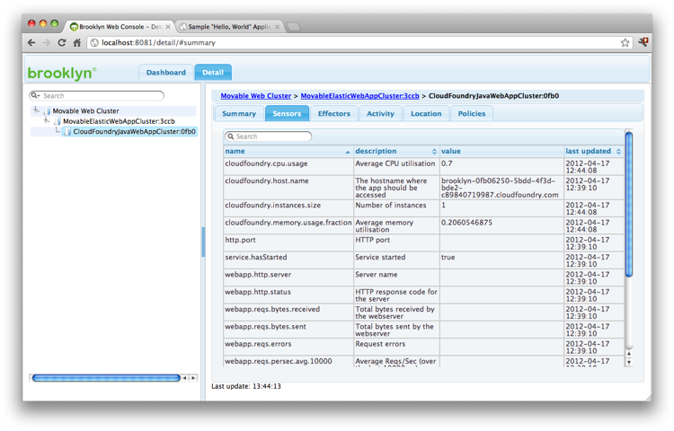

The example [Simple Web Cluster](../webcluster) showed 
how to build a web cluster from load balancers and web servers.
This example shows how Brooklyn can be used to make this interoperate 
with Java WebApp PaaS offerings such as Cloud Foundry.

This example will also cover how to write a new high-level entity,
implementing a "move" effector to move a webapp between CF locations. 

**Writing new entities requires intermediate Java skills (and slightly more work) 
than defining an application. On the plus side, entities are much easier to re-use!**   



The project ``examples/portable-cloudfoundry`` contains the code used 
in this example in ``src/main/java``.

## Deploying to Cloud Foundry

Let's start by showing how the ``ElasticJavaWebAppService`` can start
a java webapp in VMware's Cloud Foundry PaaS, just as easily as creating it
from scratch in a VM-based cloud.
We'll create our application in a Groovy class ``MovableCloudFoundryClusterExample``:


public class MovableCloudFoundryClusterExample extends AbstractApplication {

    public static final String DEFAULT_LOCATION = "cloudfoundry";
    public static final String WAR_FILE_URL = "classpath://hello-world-webapp.war";

    ElasticJavaWebAppService websvc = new ElasticWebAppService(this, war: WAR_FILE_URL);
    
    public static void main(String[] argv) {
        Application app = new MovableCloudFoundryClusterExample(name:'Movable Web Cluster');
        BrooklynLauncher.manage(app, port);
        app.start(new LocationRegistry().resolve("cloudfoundry") );
        Entities.dumpInfo(app)
    }
}


We supply the location spec string ``"cloudfoundry"`` instead of 
jclouds VM locations ``"cloudservers-uk"`` or ``"aws-ec2:us-west-1"``;
apart from that the code is unchanged.
Logic in ``"ElasticJavaWebAppService"`` determines the appropriate strategy for any cloud.
You can supply a specific Cloud Foundry endpoint by appending ``:endpoint``;
it defaults to ``"cloudfoundry:api.cloudfoundry.com"``.
The current implementation requires that ``"vmc"`` is installed and logged in to the
endpoint(s) you use.

## A ``Move`` Effector

The word ``Movable`` in the class name we just chose is misleading, so far;
let's now correct that by defining a ``move(String location)`` effector.
Because this effector might be fairly useful, we will define it in an interface
which can be easily picked up by any entity,
and invoked programmatically, in Java or a REST API, or by an operator in the web console.


public interface MovableEntityTrait {

    Effector<String> MOVE = new MethodEffector<String>(MovableEntityTrait.class, "move");
            
    /** Effectively move the entity to the new location.
     * A new entity may be created (and the old destroyed) to effect this.
     * @param location the new location where the entity should running
     * @return the entity ID of the primary entity (after the move) in the specified location */
    @Description("Effectively move the entity to the new location.")
    public String move(
            @NamedParameter("location") 
            @Description("The new location where the entity should be running") 
            String location);

}


The interface method declaration should be familiar.
The ``@Description``and ``@NamedParamter`` annotations (from ``brooklyn.entity.basic``)
facilitate self-documenting runtime usage (aka the web console).
The static field ``MOVE`` may seem unusual, but this pattern, used for sensors,
effectors, and config keys, simplifies discovery and makes pure-Java closure-style invocation more natural 
(see, for example, ``Entities.invokeEffectorList``).
Groovy users should note that the ``MethodEffector`` constructor alternatively 
accepts the method-reference notation, ``new MethodEffector<String>(MovableEntityTrait.&move)``.

## Preparing Our Movable Cluster

With this defined, let us create an entity which implements ``Movable``, and otherwise
simply wraps a webapp cluster.
We start with the ``Startable`` interface methods (effectors), 
with an implementation that delegates to an ``ElasticJavaWebAppService`` entity,
creating it if necessary, and advertising its ID through a sensor.


@InheritConstructors
class MovableElasticWebAppCluster extends AbstractEntity implements Startable, MovableEntityTrait {

    @SetFromFlag("war")
    public static final BasicConfigKey<String> ROOT_WAR = JavaWebAppService.ROOT_WAR;
    
    public static final BasicAttributeSensor<String> PRIMARY_SVC_ENTITY_ID = 
            [ String, "movable.primary.id", "Entity ID of primary web-app service" ];
    
    @Override
    public void start(Collection<? extends Location> locations) {
        if (!getOwnedChildren().isEmpty()) {
            log.debug("Starting $this; it already has children, so start on children is being invoked")
            StartableMethods.start(this, locations);
        } else {
            Entity svc = createClusterIn( Iterables.getOnlyElement(locations) );
            log.debug("Starting $this; no children, so created $svc and now starting it")
            if (svc in Startable) ((Startable)svc).start(locations);
            setAttribute(PRIMARY_SVC_ENTITY_ID, svc.id)
        }
    }

    public EntityLocal createClusterIn(Location location) {
        return new ElasticJavaWebAppService.Factory().
            newFactoryForLocation(location).
            newEntity([:], this);
    }
    
    @Override
    public void stop() {
        StartableMethods.stop(this);
    }

    @Override
    public void restart() {
        StartableMethods.restart(this);
    }
    
    @Override
    public String move(String location) {
        throw new UnsupportedOperationException();
    }
    
}


Note also that we define the ``ROOT_WAR`` config key here,
with a flag, so that users can easily specify the config value on this entity
(with configuration being inherited by descendant entities such as the wrapped cluster).  
This means we could run our new entity by changing one line in the
``MovableCloudFoundryClusterExample`` application above 
(although of course ``move`` will throw an exception):


    MovableElasticWebAppCluster websvc = new MovableElasticWebAppCluster(this, war: WAR_FILE_URL);


  
## Like to Move It Move It

Now for the fun part:  let's implement the ``move`` effector.
While this could be done as a single method, in order to provide seamless
transitioning (even allowing for DNS services to update) we will break down the
logical move operation into the following steps:

 1. Create and start a *secondary* cluster 
 1. Promote the secondary cluster so that it becomes primary, and demote the former primary cluster to be secondary
 1. Destroy the demoted cluster

This allows dependent operations, such as DNS reconfiguration, 
to be aware of completion of these individual steps -- e.g. by listening to sensors such as the ID of the primary cluster, or the IDs of the secondaries.
You might, for instance, defer the destory step, 
leaving the secondary active (and possibly configured so if forwards to the primary),
until DNS updates have finished propagating.

Let's add these three steps as effectors, along with a sensor for ``Collection<String> SECONDARY_SVC_ENTITY_IDS``.
First, we'll create a secondary cluster:


    public static final BasicAttributeSensor<Collection<String>> SECONDARY_SVC_ENTITY_IDS = 
            [ List, "movable.secondary.ids", "Entity IDs of secondary web-app services" ];

    public static final Effector<String> CREATE_SECONDARY_IN_LOCATION = 
            new MethodEffector<String>(this.&createSecondaryInLocation);
    
    /** creates a new secondary instance, in the given location, 
     * returning the ID of the secondary created and started */
    @Description("create a new secondary instance in the given location")
    public String createSecondaryInLocation(
            @NamedParameter("location") 
            @Description("the location where to start the secondary")
            String l) {
            
        Location location = new LocationRegistry().resolve(l);
        Entity svc = createClusterIn(location);
        Entities.start(managementContext, svc, [location]);
        setAttribute(SECONDARY_SVC_ENTITY_IDS, (getAttribute(SECONDARY_SVC_ENTITY_IDS) ?: []) + svc.id);
        return svc.id;
    }


Next, we'll promote that cluster and demote the former primary, emitting sensors
for the new primaries and set of secondaries:


    public static final Effector<String> PROMOTE_SECONDARY = 
            new MethodEffector<String>(this.&promoteSecondary);
    
    /** promotes the indicated secondary,
     * returning the ID of the former-primary which has been demoted */
    @Description("promote the indicated secondary to primary (demoting the existing primary)")
    public String promoteSecondary(
            @NamedParameter("idOfSecondaryToPromote") 
            @Description("ID of secondary entity to promote")
            String idOfSecondaryToPromote) {
            
        Collection<String> currentSecondaryIds = getAttribute(SECONDARY_SVC_ENTITY_IDS);
        if (!currentSecondaryIds.contains(idOfSecondaryToPromote))
            throw new IllegalStateException(
                    "Cannot promote unknown secondary $idOfSecondaryToPromote "+
                    "(available secondaries are $currentSecondaryIds)");
            
        String primaryId = getAttribute(PRIMARY_SVC_ENTITY_ID);
        
        setAttribute(PRIMARY_SVC_ENTITY_ID, idOfSecondaryToPromote);
        currentSecondaryIds.remove(idOfSecondaryToPromote);
        currentSecondaryIds << primaryId;
        setAttribute(SECONDARY_SVC_ENTITY_IDS, currentSecondaryIds);
        return primaryId;
    }


Step 3 is to destroy the demoted secondary.
(Or you could choose to leave it in place, with a minimal footprint,
achieved by a resizer policy scaling it back when it isn't being consumed.)  


    public static final Effector<String> DESTROY_SECONDARY = 
            new MethodEffector<String>(this.&destroySecondary);
    
    /** destroys the indicated secondary */
    @Description("destroy the indicated secondary")
    public void destroySecondary(
            @NamedParameter("idOfSecondaryToDestroy") 
            @Description("ID of secondary entity to destroy")
            String idOfSecondaryToDestroy) {
            
        Collection<String> currentSecondaryIds = getAttribute(SECONDARY_SVC_ENTITY_IDS);
        if (!currentSecondaryIds.contains(idOfSecondaryToDestroy))
            throw new IllegalStateException(
                    "Cannot promote unknown secondary $idOfSecondaryToDestroy "+
                    "(available secondaries are $currentSecondaryIds)");
            
        currentSecondaryIds.remove(idOfSecondaryToDestroy);
        setAttribute(SECONDARY_SVC_ENTITY_IDS, currentSecondaryIds);
        
        Entity secondary = getManagementContext().getEntity(idOfSecondaryToDestroy);
        Entities.destroy(managementContext, secondary);
    }


And finally, we'll define ``move``, as the sequence of the three effectors above:


    @Override
    public String move(String location) {
        String newPrimary = createSecondaryInLocation(location);
        String oldPrimary = promoteSecondary(newPrimary);
        destroySecondary(oldPrimary);
        return newPrimary;
    }


## Running It

When we run this application (e.g. using the ``demo.sh`` script in the example project),
we have our webapp running in Cloud Foundry,
and we have the effectors we've introduced exposed in the web console:

By clicking ``move`` and specifying a location, 
the webapp will come up at the new location and go down at the old.
This allows, for instance, moving from a CF micro-cloud to ``cloudfoundry.com``,
or to a private install (including Stackato).
Supplying the same location (e.g. ``"cloudfoundry"``) will cause
a new (different) instance to be created in the same location.
Or, as shown above, you can specify ``"localhost"`` or ``"aws-ec2"`` or any of
the targets shown in the [Simple Web Cluster example](../webcluster).

## Exercises for the Reader

If you've completed this, you're probably ready for a bigger challenge.
Here are some ideas to get you started:

 1. Combine the ``Movable`` entity built here with 
    a ``DynamicFabric`` <!-- the [Global Web Fabric example](../global-web-fabric), -->
    to make a fabric running our web-app, spanning multiple Cloud Foundry instances,
    where each instance is able to be moved as well.
    
 1. Consume a CF service, such as a database, in your web-app.
    You'll have to modify or sub-class ``CloudFoundryVmcCliAccess`` and ``CloudFoundryJavaWebAppService``
    to allow the service to be specified via ``vmc``.
    What strategies can then be used to migrate application *data* when the app is moved?

 1. Create a new Brooklyn CF entity to support an application other than a Java Web App.
    The list is (almost) endless -- Ruby, node.js, PHP, etc.

Is some of what you've built a worthy addition to Brooklyn?
If so please consider [contributing it]({{ site.url }}/dev/how-to-contrib.html) so that we can make it better
and others can benefit.

