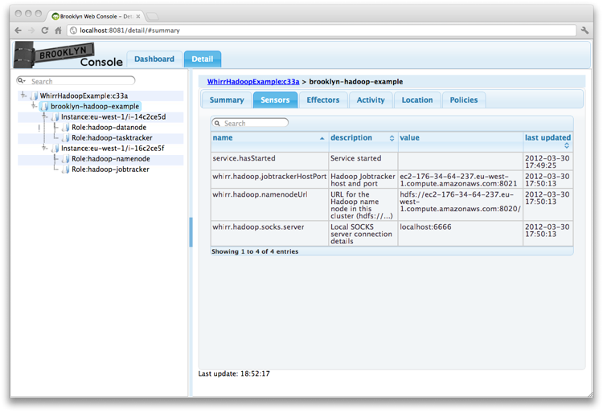



The project ``examples/hadoop-and-whirr`` includes deployment descriptors 
showing how to provision Whirr-based clusters from Brooklyn,
including setting up a Hadoop recipe.

## Background

[Apache Whirr](whirr.apache.org) is an open-source project providing
a set of libraries for launching cloud services in an easy, repeatable, and reliable way.

Brooklyn can use Whirr to launch a wide variety of services
and integrate them as part of bespoke applications.

## Whirr Hadoop

The class ``WhirrHadoopExample`` shows how a Hadoop cluster can be started
with an arbitrary size, with one line using the ``WhirrHadoopCluster`` entity.


    WhirrCluster cluster = new WhirrHadoopCluster(this, size: 2, memory: 2048);


You can run this by running ``./demo-hadoop.sh``.
This by default targets ``aws-ec2:eu-west-1``,
so you will need to set your AWS credentials as described [here]({{site.url}}/use/guide/management/index.html#startup-config). 

 

Once it is running, navigate to the Brooklyn web console to see the ``NAME_NODE_URL`` sensor.
(And not that using [``attributeWhenReady``]({{ site.url }}/use/guide/defining-applications/advanced-concepts.html#dependent), 
you can easily configure a larger application to use its own dedicated Hadoop cluster.)

## Custom Whirr Recipe

The class ``WhirrExample`` shows how an arbitrary [Whirr](http://whirr.apache.org) recipe
can be run from within Brooklyn:


    public static final String RECIPE = '''
whirr.cluster-name=brooklyn-whirr
whirr.hardware-min-ram=1024
whirr.instance-templates= 1 noop, 1 elasticsearch
'''

    WhirrCluster cluster = new WhirrCluster(this, recipe: RECIPE);


This can be launched with the script ``./demo-whirr-recipe.sh``.
Feel free to experiment with the instance template parameter,
trying out other recipes from Whirr.

With this mechanism, you can roll out Whirr-supported systems, 
ranging from Cassandra to Voldemort, including integrating 
Chef and Puppet scripts you may wish to use.
The Whirr state is loaded into Brooklyn, as well as saved to disk in the usual Whirr way.
This means it is available for programmatic extensions (as is used for Hadoop),
including defining sensors and effectors and applying policy:
stop is available, with [resize](https://issues.apache.org/jira/browse/WHIRR-214) expected soon.
