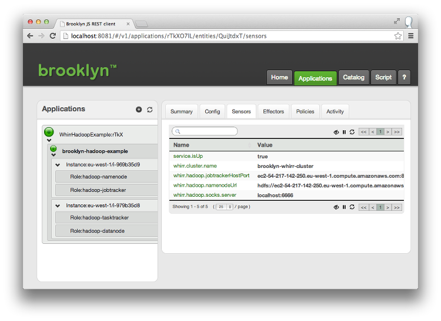



Now, go to this particular example's directory:


% cd hadoop-and-whirr


The CLI needs to know where to find your compiled examples. You can set this up by exporting
the ``BROOKLYN_CLASSPATH`` environment variable in the following way:


% export BROOKLYN_CLASSPATH=$(pwd)/target/classes


The project ``hadoop-and-whirr`` includes deployment descriptors
showing how to provision Whirr-based clusters from Brooklyn,
including setting up a Hadoop recipe.

## Background

[Apache Whirr](http://whirr.apache.org) is an open-source project providing
a set of libraries for launching cloud services in an easy, repeatable, and reliable way.

Brooklyn can use Whirr to launch a wide variety of services
and integrate them as part of bespoke applications.

## Whirr Hadoop

The class ``WhirrHadoopExample`` shows how a Hadoop cluster can be started
with an arbitrary size, using the ``WhirrHadoopCluster`` entity.


public class WhirrHadoopExample extends AbstractApplication {
    @Override
    public void init() {
        WhirrCluster cluster = addChild(EntitySpec.create(WhirrHadoopCluster.class)
                .configure("size", 2)
                .configure("memory", 2048));
    }
}


You can run this by running:


% ${BROOKLYN_HOME}/bin/brooklyn launch --app brooklyn.extras.whirr.WhirrHadoopExample --stopOnKeyPress --location aws-ec2:eu-west-1


This targets ``aws-ec2:eu-west-1`` (using jclouds),
so you will need to set your AWS credentials as described [here]({{site.url}}/use/guide/management/index.html#startup-config). 

 

Once it is running, navigate to the Brooklyn web console to see the ``NAME_NODE_URL`` sensor.
(And not that using [``attributeWhenReady``]({{ site.url }}/use/guide/defining-applications/advanced-concepts.html#dependent), 
you can easily configure a larger application to use its own dedicated Hadoop cluster.)

## Custom Whirr Recipe

The class ``WhirrExample`` shows how an arbitrary [Whirr](http://whirr.apache.org) recipe
can be run from within Brooklyn:


public class WhirrExample extends AbstractApplication {
    public static final String RECIPE =
            "whirr.cluster-name=brooklyn-whirr"+"\n"+
            "whirr.hardware-min-ram=1024"+"\n"+
            "whirr.instance-templates=1 noop, 1 elasticsearch"+"\n";

    @Override
    public void init() {
        WhirrCluster cluster = addChild(EntitySpec.create(WhirrCluster.class)
                .configure("recipe", RECIPE));
    }
}


This can be launched by running:


% ${BROOKLYN_HOME}/bin/brooklyn launch --app brooklyn.extras.whirr.WhirrExample --stopOnKeyPress --location aws-ec2:eu-west-1
 

In the provided example this will deploy to AWS.

If you would like to deploy to localhost, you can do this by running the same command and replacing ``aws-ec2:eu-west-1`` with ``localhost``. However, please note that currently there are some limitations when deploying to localhost:

*	You can not deploy more than one server (noop doesn't count in the above case).
*	This has only been tested on Ubuntu 10.04 and might cause problems on other operating systems.
*	Your user will need to be configured for [passwordless ssh and passwordless sudo](http://docs.outerthought.org/lilyenterprise-docs-trunk/539-lily/541-lily.html) on localhost.

Feel free to experiment with the instance template parameter,
trying out other recipes from Whirr.

With this mechanism, you can roll out Whirr-supported systems, 
ranging from Cassandra to Voldemort, including integrating 
Chef and Puppet scripts you may wish to use.
The Whirr state is loaded into Brooklyn, as well as saved to disk in the usual Whirr way.
This means it is available for programmatic extensions (as is used for Hadoop),
including defining sensors and effectors and applying policy:
stop is available, with [resize](https://issues.apache.org/jira/browse/WHIRR-214) expected soon
(making it easy -- or at least much easier -- to write custom **elasticity policies**).

## Integrating with Other Entities

The real interest of Brooklyn working with Whirr, of course, is to combine systems such as Hadoop
with your custom applications which use these systems.
One example, combining the [Global Web Fabric example]({{ site.url }}/use/examples/global-web-fabric)
with the Whirr Hadoop entity, is included in this example project.
A Hadoop-based chatroom web app, performing map-reduce (and a few necessary contortions to work with private subnets)
is in ``WebFabricWithHadoopExample``. 
 