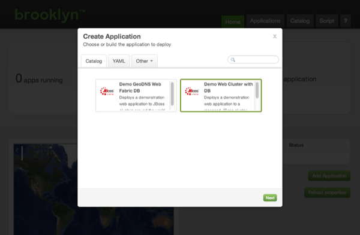
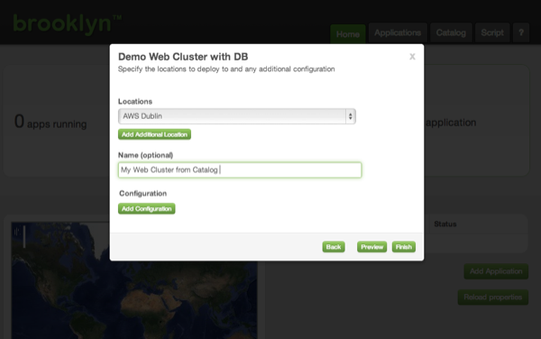



In the [previous step](index.html) we downloaded Brooklyn and used it to deploy an application to a cloud, but at its heart Brooklyn is a policy driven *management* plane.

Here we will introduce Polices using a simple demo app, which we will load from a Service Catalog.

## Service Catalogs

Download the template [catalog.xml](catalog.xml) to your `~/.brooklyn/` folder, and relaunch Brooklyn.


$ cd ~/.brooklyn
$ wget {{site.url}}/use/guide/quickstart/catalog.xml

$ brooklyn launch


Now when we open the web console, two applications are displayed from the catalog.

Select the 'Demo Web Cluster with DB' and click 'Next'.

Select the Location that Brooklyn should deploy to, and name your application:

Click 'Finish' to launch the application as before.

### Exploring and Testing Policies

The Demo Web Cluster with DB application is pre-configured with two polices.

The app server cluster has an `AutoScalerPolicy`, and the loadbalancer has a `targets` policy.

Use the Applications tab in the web console to drill down into the Policies section of the ControlledDynamicWebAppCluster's Cluster of JBoss7Servers.

You will see that the `AutoScalerPolicy` is running.

This policy automatically scales the cluster up or down to be the right size for the cluster's current load. (One server is the minimum size allowed by the policy.)

The loadbalancer's `targets` policy ensures that the loadbalancer is updated as the cluster size changes.

Sitting idle, this cluster will only contain one server, but you can use a tool like [jmeter](http://jmeter.apache.org/) pointed at the nginx endpoint to create load on the cluster. (Download a [jmeter test plan](https://github.com/brooklyncentral/brooklyn/blob/master/examples/simple-web-cluster/resources/jmeter-test-plan.jmx).)

As load is added, Brooklyn requests a new cloud machine, creates a new app server, and adds it to the cluster. As load is removed, servers are removed from the cluster, and the infrastructure is handed back to the cloud.

### Next

The [Elastic Web Cluster Example]({{site.url}}use/examples/webcluster/index.html) page
details how to build this demo application from scratch in Java. It shows in more detail how Brooklyn can
complement your application with policy driven management, and how applications can be
run from the command line.

