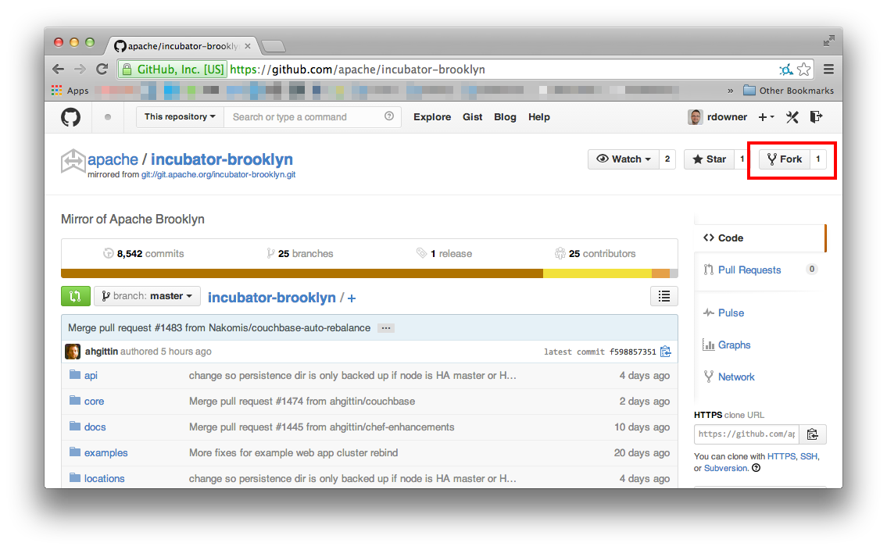

Prior to our adoption by the Apache Incubator, Brooklyn was developed in a
GitHub repository at `https://github.com/brooklyncentral/brooklyn`. If you
already have a fork of this repository, follow this guide to smoothly shift
your repository references to the new repository at Apache.

If you have not forked or cloned the `brooklyncentral/brooklyn` repository,
then this is not the right guide for you. Instead, you should refer to the
[How to contribute](how-to-contribute.html) page, and possibly refer to
[GitHub Help - Fork A Repo](https://help.github.com/articles/fork-a-repo) for
further help.


Assumptions
-----------

This guides assumes that you have followed the standard GitHub workflow, as
describe in [GitHub Help - Fork A Repo](https://help.github.com/articles/fork-a-repo).
In particular:

- You have forked the `brooklyncentral/brooklyn` repository into your own
  username:


- You have used `git clone` to clone this fork onto your own computer;
- You have added an additional remote, `upstream`, to refer to the original
  `brooklyncentral/brooklyn` repository.

In short, if you can recognise the above screenshot, and the output of the
`git remote -v` command looks similar to below, then this guide should work
for you. (Replace `rdowner` with your own GitHub username.)

    origin  https://github.com/rdowner/brooklyn.git (fetch)
    origin  https://github.com/rdowner/brooklyn.git (push)
    upstream        https://github.com/brooklyncentral/brooklyn (fetch)
    upstream        https://github.com/brooklyncentral/brooklyn (push)

Or, if you are using SSH to access your remote repositories, it may look like
this:

    origin  git@github.com:rdowner/brooklyn.git (fetch)
    origin  git@github.com:rdowner/brooklyn.git (push)
    upstream        git@github.com:brooklyncentral/brooklyn.git (fetch)
    upstream        git@github.com:brooklyncentral/brooklyn (push)


Procedure
---------

The new repository has a mirror in GitHub, located at
[https://github.com/apache/incubator-brooklyn](https://github.com/apache/incubator-brooklyn).
Go to this page now, and fork it:



This will now create a fork of this repository under your own username:


So previously you referred to repositories named `brooklyn` under the
`brooklyncentral` organization and your own username. Now, you will need to
refer to repositories named `incubator-brooklyn` under the `Apache`
organization and your own username.

To update the cloned repository on your computer to point to the new
repositories instead of the old ones, use these commands, replacing `rdowner`
with your own GitHub username.

    git remote set-url origin https://github.com/rdowner/incubator-brooklyn.git
    git remote set-url upstream https://github.com/apache/incubator-brooklyn.git

Or, if you would prefer to use SSH to access your remote repositories:

    git remote set-url origin git@github.com:rdowner/incubator-brooklyn.git
    git remote set-url upstream git@github.com:apache/incubator-brooklyn.git

Finally, fetch everything:

    git fetch --all


Existing pull requests
----------------------

If you have submitted a pull request at `brooklyncentral/brooklyn`, this pull
request will be closed, unmerged, with a message pointing you to this page. You
will need to re-submit your pull request against the
`apache/incubator-brooklyn`.

If you have followed the above procedure, all you will need to do is identify
the branch in your local repository on your computer that you used to make the
original pull request, and push this to your new fork:

```
git push origin my-new-feature-branch
```

Now, go to your `incubator-brooklyn` fork on the GitHub website, and you should
see the **Compare &amp; pull request** button; click this, and it will set up a
pull request against the new repository.


Any problems?
-------------

If you are not sure how to do this, perhaps because you have a slightly
different arrangement in your repositories, or is something unusual happens,
please ask our community for help. You can find details of our IRC channel
and mailing lists on our [Community](index.html) page.
