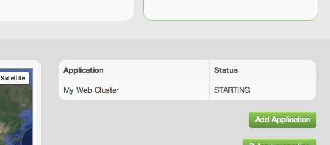

This guide will walk you through deploying an application to a public cloud.

We will be deploying an example 3-tier web application, described using this blueprint: 





(This is written in YAML, following the [camp specification](https://www.oasis-open.org/committees/camp/). )

This tutorial assumes that you are using Linux or Mac OSX.

## Verify SSH

Brooklyn uses SSH extensively and therefore it is worth making sure that you have a known working SSH setup before
starting.

Please check the following items:

- If you are using Mac OSX, open System Preferences, go to the Sharing item, and enable 'Remote Login'
- You have a files named `~/.ssh/id_rsa` and `~/.ssh/id_rsa.pub`
- `~/.ssh/id_rsa` is NOT readable by any other user
  - You can verify this with `ls -l ~/.ssh/id_rsa` - the line should start with `-rw-------` or `-r--------`. If it
    does not, execute `chmod 0600 ~/.ssh/id_rsa`.
- The file `~/.ssh/authorized_keys` exists and contains a copy of your public key from `~/.ssh/id_rsa.pub`.
  - Note that it is normal for it to contain other items as well.
- The key in `~/.ssh/id_rsa` does *not* have a passphrase.
  - You can test this by executing `ssh-keygen -y`. If it does *not* ask for a passphrase, then your key is OK.
  - If your key does have a passphrase, remove it. You can do this by running `ssh-keygen -p`. Enter the passphrase,
    then when prompted for the new passphrase, hit Enter.

Now verify your setup by running the command: `ssh localhost echo hello world`

If you see a message similar to this:

<pre>
The authenticity of host 'localhost (::1)' can't be established.
RSA key fingerprint is 7b:e3:8e:c6:5b:2a:05:a1:7c:8a:cf:d1:6a:83:c2:ad.
Are you sure you want to continue connecting (yes/no)?
</pre>

then answer 'yes', and then repeat the command run again.

If the response is `hello world`, with no other output or prompts, then your SSH setup is good and Brooklyn should be
able to use it without a problem.

If these steps are not working, [these instructions]({{ site.data.brooklyn.url.userguide }}/use/guide/locations/) may be
useful.

## Install Brooklyn

Download the [Brooklyn distribution]({{ site.data.brooklyn.url.dist.tgz }}) and expand it to your home directory ( `~/` ), or in a location of your choice. (Other [download options]({{site.path.website}}/download.html) are available.)


Expand the `tar.gz` archive (note: as this is a -SNAPSHOT version, your filename will be slightly different):

Expand the `tar.gz` archive:




$ tar -zxf brooklyn-dist-{{ site.data.brooklyn.version }}-timestamp-dist.tar.gz



$ tar -zxf brooklyn-dist-{{ site.data.brooklyn.version }}-dist.tar.gz



This will create a `brooklyn-{{ site.data.brooklyn.version }}` folder.

Note: You'll need a Java JRE or SDK installed (version 6 or later), as Brooklyn is Java under the covers.

## Launch Brooklyn

Let's setup some paths for easy commands.

(Click the clipboard on these code snippets for easier c&p.)


$ cd brooklyn-{{ site.data.brooklyn.version }}
$ BROOKLYN_DIR="$(pwd)"
$ export PATH=$PATH:$BROOKLYN_DIR/bin/


We can do a quick test drive by launching Brooklyn:


$ brooklyn launch


Brooklyn will output the address of the management interface:

`INFO  Starting brooklyn web-console on loopback interface because no security config is set`

`INFO  Started Brooklyn console at http://127.0.0.1:8081/, running classpath://brooklyn.war and []`

But before we really use Brooklyn, we need to setup some Locations.
 
Stop Brooklyn with ctrl-c.

## Configuring a Location

Brooklyn deploys applications to Locations.

Locations can be clouds, machines with fixed IPs or localhost (for testing).

Brooklyn loads Location configuration  from `~/.brooklyn/brooklyn.properties`. 

Create a `.brooklyn` folder in your home directory and download the template [brooklyn.properties](brooklyn.properties) to that folder.


$ mkdir ~/.brooklyn
$ cd ~/.brooklyn
$ wget {{site.url_root}}{{site.path.website}}/quickstart/brooklyn.properties


Open brooklyn.properties in a text editor and add your cloud credentials.

Restart Brooklyn:


$ brooklyn launch


## Launching an Application

There are several ways to deploy a YAML blueprint (including specifying the blueprint on the command line or submitting it via the REST API).

For now, we will simply copy-and-paste the raw YAML blueprint into the web console.

Open the web console ([127.0.0.1:8081](http://127.0.0.1:8081)). As Brooklyn is not currently managing any applications the 'Create Application' dialog opens automatically. Select the YAML tab.

### Chose your Cloud / Location

Let's look again at our YAML blueprint:





Copy this document into the large text box on the YAML tab, labelled `Enter CAMP Plan YAML code here`. But *before* you
submit it, we need to make a modification.

Find the line near the top of the blueprint that starts `location:`. Change the line to name a location. For example,
one of these lines:


location: aws-ec2:us-east-1
location: rackspace-cloudservers-us:ORD
location: google-compute-engine:europe-west1-a
location: localhost


**My Web Cluster Blueprint**

With the modified YAML in the dialog, click 'Finish'. The dialog will close and Brooklyn will begin deploying your
application. Your application will be shown as 'Starting' on the web console's front page.

## Monitoring and Managing Applications

Click on the application name, or open the Applications tab.

We can explore the management hierarchy of the application, which will show us the entities it is composed of.

 * My Web Cluster (A `BasicApplication`)
     * My DB (A `MySqlNode`)
     * My Web (A `ControlledDynamicWebAppCluster`)
        * Cluster of JBoss7 Servers (A `DynamicWebAppCluster`)
        * NginxController (An `NginxController`)

Clicking on the 'My Web' entity will show the Summary tab. Here we can see if the cluster is ready to serve and, when ready, grab the web address for the front of the loadbalancer.

The Activity tab allows us to drill down into what activities each entity is currently doing or has recently done. It is possible to drill down to all child tasks, and view the commands issued, and any errors or warnings that occured.

Drill into the 'My DB' start operation. Working down through  'Start (processes)', then 'launch', we can discover the ssh command used including the stdin, stdout and stderr.

## Stopping the Application

To stop an application, select the application in the tree view (the top/root entity), click on the Effectors tab, and invoke the 'Stop' effector. This will cleanly shutdown all components in the application and return any cloud machines that were being used.

### Next 

So far we have touched on Brooklyn's ability to *deploy* an application blueprint to a cloud provider, but this a very small part of Brooklyn's capabilities!

Brooklyn's real power is in using Policies to automatically *manage* applications. There is also the (very useful) ability to store a catalog of application blueprints, ready to go.

[Getting Started - Policies and Catalogs](policies-and-catalogs.html)
